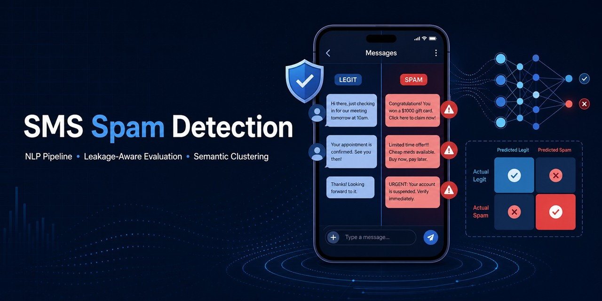
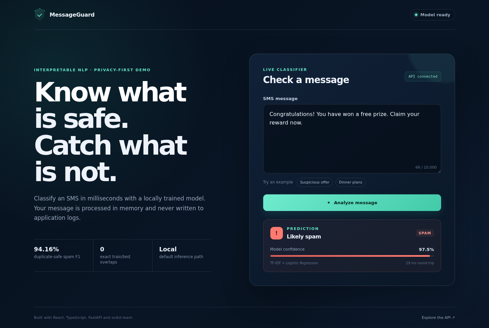
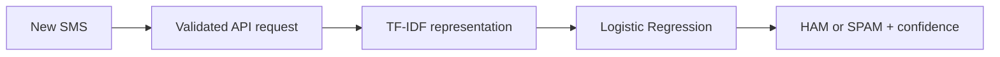
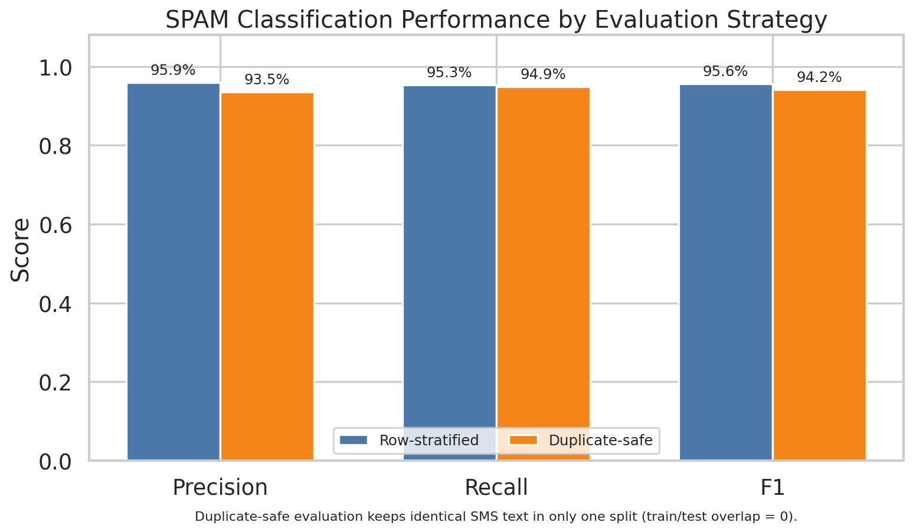
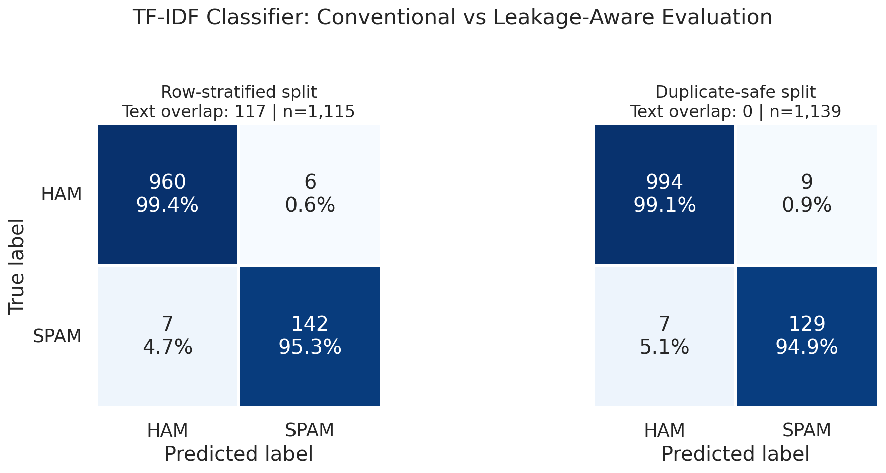
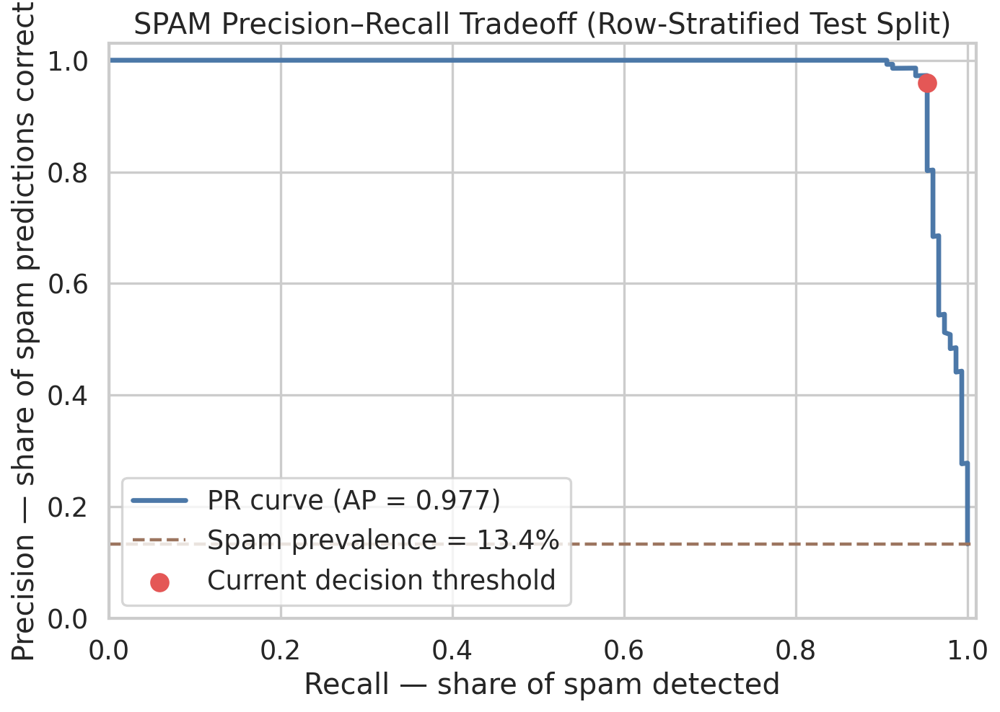
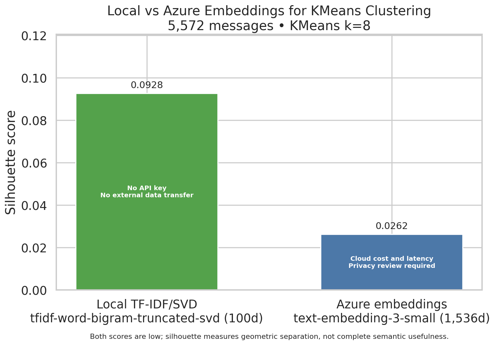

# SMS Spam Detection NLP Pipeline

[](https://github.com/ErmisCho/sms-spam-detection-nlp/actions/workflows/ci.yml)
[](https://www.python.org/)
[](LICENSE)



Classify a new SMS as legitimate or spam, return a confidence score, and explore the result through a polished browser interface. This independent portfolio project shows the complete path from raw data to a reproducible, containerized full-stack ML service—not only a notebook or model score.

[See it work](#see-it-work) · [Review the results](#results-at-a-glance) · [Run it locally](#setup) · [Use the API](#prediction-api) · [View the architecture](docs/architecture.md)

## At a Glance

| Question | Answer |
| --- | --- |
| What problem does it solve? | Flags suspicious SMS messages while keeping prediction confidence visible. |
| What does it deliver? | React/TypeScript demo, reproducible training pipeline, CLI, versioned FastAPI service, Docker image, tests, reports, and diagrams. |
| How well does it work? | 94.16% duplicate-safe SPAM F1; the conventional split produced only 13 errors across 1,115 test messages. |
| Can it run without cloud services? | Yes. The complete default path is local, private, and requires no API key. |
| What makes the evaluation credible? | Exact duplicate messages are kept out of both train and test, eliminating text overlap in the stricter evaluation. |

## See It Work



The responsive MessageGuard interface sends a new SMS to the same tested prediction function used by the CLI and API. It displays the HAM/SPAM label, confidence, round-trip latency, model readiness, and actionable error states without storing message content in application logs.

The same prediction contract remains available through the CLI and interactive OpenAPI page for technical reviewers.



## Results at a Glance

| Evaluation | Accuracy | SPAM F1 | Exact train/test text overlap |
| --- | ---: | ---: | ---: |
| Conventional row split | 98.83% | 95.62% | 117 messages |
| Duplicate-safe split | 98.60% | **94.16%** | **0 messages** |

The duplicate-safe result is the preferred estimate because it prevents identical SMS text from appearing on both sides of the evaluation.



## Why It Stands Out

- **Usable software, not only analysis:** a responsive React/TypeScript product interface, typed FastAPI service, OpenAPI contract, CLI, non-root Docker image, and readiness checks make the model practical to evaluate and integrate.
- **Honest evaluation:** duplicate-safe testing exposes leakage instead of presenting the most flattering number.
- **Reviewable failure modes:** confusion matrices and exported false positives/negatives show where the classifier is wrong.
- **Reproducible by default:** uv lockfile, Python 3.10–3.13 CI, deterministic tests, and a fully local path require no secrets.
- **Evidence-based cloud comparison:** optional Azure embeddings were tested, documented, and rejected as the default when they did not improve cluster separation.

<details>
<summary><strong>Explore the detailed evaluation charts</strong></summary>

### Confusion matrices



The conventional split makes the model's six false positives and seven false negatives visible. The second matrix shows performance after eliminating identical train/test message overlap.



This curve shows how stricter or looser thresholds trade spam recall against false alarms. It is more informative than accuracy alone because only 13.4% of messages are spam.

### Local versus Azure clustering



Across the same 5,572 messages, local TF-IDF/SVD achieved a silhouette score of 0.0928 versus 0.0262 for Azure `text-embedding-3-small`. Azure did not improve cluster separation in this experiment, so the free, private, reproducible local path remains the default.

</details>

## 30-Second Demo

After completing [Setup](#setup) and [downloading the dataset](#dataset), run the complete local workflow with no API key:

```bash
bash scripts/run_pipeline.sh
```

On Windows PowerShell, use `.\scripts\run_pipeline.ps1` instead. The workflow validates the raw data, analyzes its vocabulary, trains and evaluates the classifier, clusters messages, and refreshes the reviewable artifacts in `outputs/`.

For a quick results tour, open:

- [Classification report](outputs/classification_report.md) for row-stratified and duplicate-safe metrics.
- [Error examples](outputs/error_examples.csv) to inspect false positives and false negatives.
- [Cluster summary](outputs/cluster_summary.md) for discovered message themes and label mix.
- [Artifact index](outputs/artifact_index.md) for the complete generated deliverable set.

## Technical Guide

The sections below contain the reproducible setup, API, Docker, architecture, and verification details for technical reviewers.

### Dataset

The project uses the public SMS Spam Collection dataset from the UCI Machine Learning Repository. The repository includes only an empty placeholder directory, not the raw dataset file.

Download it after setup:

```powershell
.\scripts\download_dataset.ps1
```

```bash
bash scripts/download_dataset.sh
```

Both commands download the public UCI archive and extract `SMSSpamCollection` into `data/raw/`.

Expected file format:

```text
ham<TAB>Ok lar... Joking wif u oni...
spam<TAB>Free entry in 2 a wkly comp...
```

Dataset citation:

> Almeida, T. & Hidalgo, J. (2011). SMS Spam Collection [Dataset]. UCI Machine Learning Repository. https://doi.org/10.24432/C5CC84

The UCI dataset page states that the dataset is licensed under Creative Commons Attribution 4.0 International (CC BY 4.0), allowing sharing and adaptation with appropriate credit.

Source: https://archive.ics.uci.edu/dataset/228/sms+spam+collection

### Setup

Use Python 3.10 through 3.13 from the repository root. The recommended workflow uses [uv](https://docs.astral.sh/uv/); `uv.lock` pins a reproducible dependency set.

Native Windows PowerShell:

```powershell
$env:UV_PROJECT_ENVIRONMENT = ".venv-win"
uv sync --locked
```

The explicit Windows environment name avoids colliding with the Linux/WSL `.venv` when both systems use the same checkout.

Linux or WSL:

```bash
uv sync --locked
```

If uv is unavailable, `requirements.txt` remains a pip-compatible fallback that installs the third-party libraries and local `src/` package.

### Run

Recommended local run on Windows:

```powershell
.\scripts\run_pipeline.ps1
```

Recommended local run on Linux or WSL:

```bash
bash scripts/run_pipeline.sh
```

Both commands run dataset validation, text analysis, TF-IDF model training/evaluation, local semantic clustering, and output generation. The default local clustering path uses TF-IDF plus TruncatedSVD embeddings, so it needs no API key or model download.

Azure embedding variants:

```powershell
# Azure OpenAI sample for a quick semantic clustering check
.\scripts\run_pipeline.ps1 -UseAzure -AzureSampleSize 250 -AzureClusters 6

# Full-dataset Azure OpenAI embeddings
.\scripts\run_pipeline.ps1 -FullAzure -AzureClusters 8
```

```bash
# Azure OpenAI sample for a quick semantic clustering check
bash scripts/run_pipeline.sh --use-azure --azure-sample-size 250 --azure-clusters 6

# Full-dataset Azure OpenAI embeddings
bash scripts/run_pipeline.sh --full-azure --azure-clusters 8
```

The Azure path is the GenAI embedding implementation. The local path creates classical TF-IDF/SVD vectors for reproducibility; it is not an LLM embedding model.

Manual module commands with uv:

```bash
uv run --frozen python -m sms_spam_ham_analysis.data --input data/raw --output outputs/validated_sms_dataset.csv
uv run --frozen python -m sms_spam_ham_analysis.analysis --dataset outputs/validated_sms_dataset.csv
uv run --frozen python -m sms_spam_ham_analysis.modeling --dataset outputs/validated_sms_dataset.csv --model-out outputs/models/tfidf_classifier.joblib
uv run --frozen python -m sms_spam_ham_analysis.clustering --dataset outputs/validated_sms_dataset.csv --clusters auto
uv run --frozen python -m sms_spam_ham_analysis.visualize --outputs outputs
```

Try the trained classifier on a message (the local pipeline must have been run first):

```powershell
$env:UV_PROJECT_ENVIRONMENT = ".venv-win" # Windows only; reuse the value set during setup
uv run --frozen python -m sms_spam_ham_analysis.predict "Congratulations, claim your free prize now"
```

The command prints the predicted `HAM`/`SPAM` label and the classifier's confidence. On the current trained artifact, this example is classified as `SPAM` with 94.3% confidence.

#### Browser Demo

Build the locked React/TypeScript frontend, then start FastAPI from the repository root:

```powershell
Set-Location frontend
npm ci
npm run build
Set-Location ..
$env:UV_PROJECT_ENVIRONMENT = ".venv-win"
uv run --frozen python -m sms_spam_ham_analysis.api
```

```bash
cd frontend
npm ci
npm run build
cd ..
uv run --frozen python -m sms_spam_ham_analysis.api
```

Open `http://127.0.0.1:8000` for the product interface. During frontend development, run `npm run dev` inside `frontend/`; Vite serves `http://127.0.0.1:5173` and proxies `/api` and `/health` to FastAPI on port 8000, so development and production both use same-origin requests.

#### Prediction API

Start the typed HTTP service after training the local model:

```powershell
$env:UV_PROJECT_ENVIRONMENT = ".venv-win" # Windows only
uv run --frozen python -m sms_spam_ham_analysis.api
```

```bash
uv run --frozen python -m sms_spam_ham_analysis.api
```

Submit a new message from another terminal:

```powershell
Invoke-RestMethod -Method Post -Uri http://127.0.0.1:8000/api/v1/predict `
  -ContentType "application/json" `
  -Body '{"text":"Congratulations, claim your free prize now"}'
```

```bash
curl -X POST http://127.0.0.1:8000/api/v1/predict \
  -H 'Content-Type: application/json' \
  -d '{"text":"Congratulations, claim your free prize now"}'
```

Response:

```json
{"label":"spam","confidence":0.943}
```

Interactive OpenAPI documentation is available at `http://127.0.0.1:8000/docs`. `POST /predict` remains as a deprecated compatibility alias for existing clients. `GET /health/live` reports process health, while `GET /health/ready` returns success only when the configured model artifact is loadable. Request logs include request ID, route, status, and latency but never SMS content.

The API uses `outputs/models/tfidf_classifier.joblib` by default. Set `SMS_SPAM_MODEL_PATH` to an alternative trusted artifact path before startup when needed.

#### Docker

Build the non-root full-stack image. Its first stage compiles the locked frontend; the runtime stage contains FastAPI and the static browser assets:

```bash
docker build -t sms-spam-api .
```

Run it with the locally trained model mounted read-only:

```powershell
docker run --rm -p 8000:8000 `
  --mount "type=bind,source=$PWD\outputs\models,target=/models,readonly" `
  sms-spam-api
```

```bash
docker run --rm -p 8000:8000 \
  --mount type=bind,source="$(pwd)/outputs/models",target=/models,readonly \
  sms-spam-api
```

The model is intentionally not baked into the image. `joblib` deserialization can execute Python code, so mount only artifacts produced by a trusted training pipeline.

Open `http://127.0.0.1:8000` for the browser demo or `http://127.0.0.1:8000/docs` for OpenAPI after the container becomes ready.

If the dataset has not been downloaded yet, run:

```bash
uv run --frozen python -m sms_spam_ham_analysis.download_data
```

### Azure Embeddings

The default local run does not need `.env`. For Azure semantic clustering, copy `.env.example` to `.env` and fill in every `AZURE_OPENAI_*` value before running an Azure command. Azure pipeline variants fail before dataset validation if required values are missing or still contain template placeholders.

Azure sends SMS text to the configured embedding deployment, so consider cost, privacy, and data handling policy before using it. If Azure returns rate-limit or transient service errors, lower `AZURE_OPENAI_CONCURRENCY` first.

### Outputs

Important generated files:

- `outputs/validated_sms_dataset.csv`: normalized dataset with `row_id`, `label`, and `text`.
- `outputs/dataset_validation.json`: raw-file validation summary.
- `outputs/frequent_words.md`: most frequent tokens.
- `outputs/vocabulary_findings.md`: HAM-typical and SPAM-typical words.
- `outputs/ngram_findings.md`: frequent bigrams and trigrams.
- `outputs/model_metrics.json`: classifier metrics.
- `outputs/classification_report.md`: row-stratified and duplicate-safe classifier reports.
- `outputs/error_examples.csv`: false positives and false negatives.
- `outputs/semantic_clusters.csv`: current clustering assignments.
- `outputs/cluster_summary.md`: current cluster sizes, label mix, themes, and representatives.
- `outputs/clustering/local/` and `outputs/clustering/azure/`: provider-specific clustering copies when those runs have been executed.
- `outputs/clustering/provider_comparison.md`: local-vs-Azure clustering comparison based on generated provider metadata.
- `outputs/artifact_index.md`: generated tables, reports, models, and figures.

### Architecture

See the [prediction service architecture](docs/architecture.md) and [serving decision record](docs/adr/0001-serve-the-existing-model-through-a-thin-api.md) for the runtime diagram, health semantics, privacy boundaries, and deliberately excluded production infrastructure.

- `data.py`: raw-file discovery, format checks, label/text validation, duplicate reporting, and normalized CSV output.
- `analysis.py`: frequent words, spam-vs-legitimate vocabulary differences, and n-grams.
- `model.py` and `modeling.py`: TF-IDF representation, Logistic Regression, deterministic evaluation, duplicate-safe grouped evaluation, metrics, and error examples.
- `embeddings.py`: local TF-IDF/SVD embeddings and optional Azure embedding API integration with batching, retries, concurrency, and fail-fast config validation.
- `clustering.py`: KMeans clustering over embedding vectors, cluster summaries, provider-specific output folders, and silhouette diagnostics.
- `visualize.py`: compact figures, artifact index, and provider comparison.
- `predict.py`: shared cached artifact loading and confidence-based single-message prediction used by both CLI and API.
- `api.py`: versioned FastAPI contracts, static frontend serving, liveness/readiness checks, request IDs, privacy-safe structured logs, and HTTP error mapping.
- `frontend/`: focused React/TypeScript interface, typed API client, responsive and accessible interaction states, component tests, and a Vite production build.

### Engineering Decisions

- **Start with an interpretable baseline.** TF-IDF and Logistic Regression are fast, reproducible, and easy to inspect. They establish a strong benchmark before adding more expensive model complexity.
- **Evaluate duplicate-safe performance.** Repeated SMS text can leak across a conventional random split and inflate results. The grouped evaluation keeps normalized duplicate messages together and reports zero train/test text overlap.
- **Keep the default workflow local.** TF-IDF/SVD clustering makes the full pipeline runnable without credentials, network calls, or per-request cost. Azure embeddings remain an explicit opt-in path for comparing semantic representations.
- **Treat errors as deliverables.** Aggregate metrics are paired with a confusion matrix and exported misclassifications so reviewers can examine failure modes—especially spam false negatives—rather than relying on accuracy alone.
- **Separate generated artifacts by provider.** Local and Azure clustering outputs retain their own metadata and summaries, making comparisons traceable without silently overwriting the provenance of a result.
- **Keep serving thin and stateless.** FastAPI adapts the shared prediction function instead of reimplementing model behavior; the trusted model is mounted separately so application and artifact releases remain independent.
- **Use one origin in production.** FastAPI serves the compiled React assets and the versioned API from one container. Vite proxies the same relative routes during development, avoiding environment-specific CORS configuration while keeping frontend and backend source boundaries clear.

### Verification

Run the automated smoke tests without the real dataset:

```powershell
$env:UV_PROJECT_ENVIRONMENT = ".venv-win"
uv sync --locked
uv run --frozen coverage run --branch -m unittest discover -s tests
uv run --frozen coverage report --include="src/sms_spam_ham_analysis/api.py,src/sms_spam_ham_analysis/predict.py" --fail-under=85
uv run --frozen python -m compileall -q src
```

Verify the frontend from `frontend/` on either platform:

```bash
npm ci
npm run check
```

`npm run check` runs the interaction tests, TypeScript compiler, and optimized Vite build. CI performs these checks independently of the Python 3.10–3.13 matrix and also builds the complete multi-stage Docker image.

Linux or WSL:

```bash
uv sync --locked
uv run --frozen coverage run --branch -m unittest discover -s tests
uv run --frozen coverage report --include="src/sms_spam_ham_analysis/api.py,src/sms_spam_ham_analysis/predict.py" --fail-under=85
uv run --frozen python -m compileall -q src
```

### Limitations

- The SMS dataset is old, so modern spam patterns may differ.
- The classifier is a strong baseline, not a production spam filter.
- Clustering is exploratory. Silhouette score is a useful separation diagnostic, but provider choice should also consider representative messages, label mix, business usefulness, cost, privacy, and reproducibility.
- Azure embeddings require approved data handling, credentials, and cost awareness.
- The API is a portfolio reference service, not an internet-hardened spam gateway; production still needs authenticated TLS ingress, rate limiting, metrics/alerting, deployment automation, a model registry, monitored retraining, and threshold governance.
