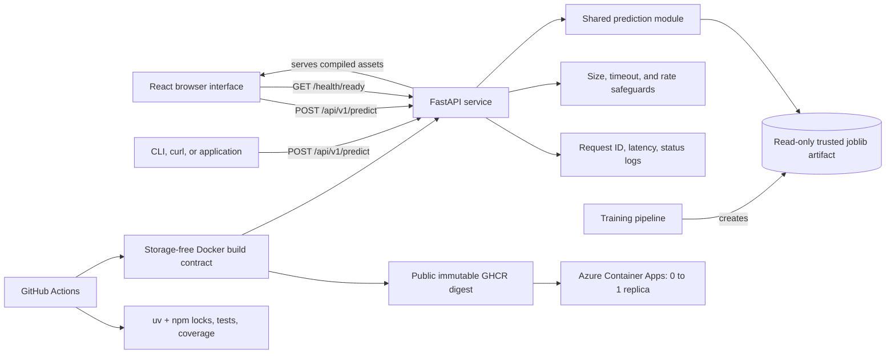

# Prediction Service Architecture

The serving layer remains intentionally small: it exposes the existing classifier through a product interface and versioned API without coupling HTTP concerns to model training or duplicating prediction logic.

## Runtime request

1. The browser or API client submits one SMS to `POST /api/v1/predict`.
2. FastAPI applies the body-size, per-client rate, and timeout limits, then validates unknown fields and empty text.
3. The shared prediction module loads the configured artifact, cached by path, modification time, and size.
4. The TF-IDF and Logistic Regression pipeline returns a label and probability-based confidence.
5. The API returns only the stable response contract. Logs contain request metadata, never the SMS body.

`POST /predict` remains a deprecated compatibility alias. The React client calls only relative `/api` and `/health` URLs: Vite proxies them during development, while FastAPI serves the compiled frontend and API from the same origin in production.

## Health semantics

- `GET /health/live` confirms that the process can answer HTTP requests and reports model readiness.
- `GET /health/ready` returns `200` only when the configured model can be loaded; otherwise it returns `503`.
- `GET /health` provides a human-friendly combined status for demos and operational checks.

The Docker health check uses readiness, preventing a container with a missing or corrupt model from being treated as ready to receive predictions.

## Security and privacy boundaries

- SMS content is not written to service logs.
- Error responses do not reveal filesystem paths or artifact internals.
- The container runs as a non-root user. Its default model is generated from a fixed synthetic corpus and checksum-verified during the image build; a trusted UCI-trained artifact can still be mounted read-only for local evaluation.
- The browser build makes no analytics, font, or other third-party runtime requests.
- `joblib` artifacts can execute Python during deserialization. Only artifacts created by a trusted training pipeline may be mounted.
- Prediction routes have conservative single-instance request limits, but authentication, distributed abuse controls, and formal data-retention policy remain deployment concerns.
- The Azure baseline terminates HTTPS at the default Container Apps ingress, scales from zero to at most one replica, and persists no application logs.

## Deliberate scope

This repository demonstrates a single stateless inference service with a focused product interface and a deliberately small public-demo deployment. Kubernetes, a database, authentication, a task queue, and distributed tracing would add operational surface without addressing the current single-model, low-throughput use case. The next production steps would be model registry integration, authenticated ingress, distributed rate limiting, durable metrics/alerting, and monitored retraining.

See [ADR 0001](adr/0001-serve-the-existing-model-through-a-thin-api.md) for the serving decision, [ADR 0002](adr/0002-serve-react-demo-from-api-origin.md) for the frontend deployment decision, and [ADR 0003](adr/0003-use-a-storage-free-azure-demo-runtime.md) for the hosted model and Azure cost-boundary decision.
