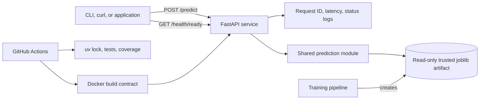

# Prediction Service Architecture

The serving layer is intentionally small: it exposes the existing classifier without coupling HTTP concerns to model training or duplicating prediction logic.

## Runtime request

1. The client submits one SMS to `POST /predict`.
2. FastAPI validates the request body and rejects unknown fields or empty text.
3. The shared prediction module loads the configured artifact, cached by path, modification time, and size.
4. The TF-IDF and Logistic Regression pipeline returns a label and probability-based confidence.
5. The API returns only the stable response contract. Logs contain request metadata, never the SMS body.

## Health semantics

- `GET /health/live` confirms that the process can answer HTTP requests and reports model readiness.
- `GET /health/ready` returns `200` only when the configured model can be loaded; otherwise it returns `503`.
- `GET /health` provides a human-friendly combined status for demos and operational checks.

The Docker health check uses readiness, preventing a container with a missing or corrupt model from being treated as ready to receive predictions.

## Security and privacy boundaries

- SMS content is not written to service logs.
- Error responses do not reveal filesystem paths or artifact internals.
- The container runs as a non-root user and expects a read-only model mount.
- `joblib` artifacts can execute Python during deserialization. Only artifacts created by a trusted training pipeline may be mounted.
- Authentication, transport TLS, rate limiting, abuse controls, and data-retention policy belong at the deployment boundary and are not claimed by this portfolio service.

## Deliberate scope

This repository demonstrates a single stateless inference service. Kubernetes, a database, a task queue, and distributed tracing would add operational surface without addressing the current single-model, low-throughput use case. The next production steps would be model registry integration, authenticated ingress, metrics export, deployment automation, and monitored retraining.

See [ADR 0001](adr/0001-serve-the-existing-model-through-a-thin-api.md) for the main design decision.
